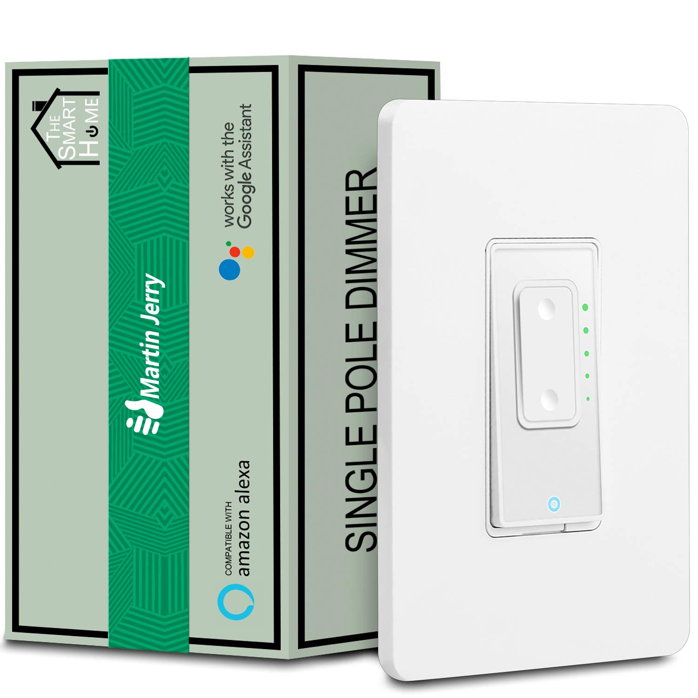

# Martin Jerry Dimmer MJ-SD01 -> Exhaust Fan Timer

#### Info:

Offers 10, 20, 30, and 60 minute timers as well as an always-on mode.

Uses the LEDs to display time remaining.

Defaults to 10 minute timer with any button press or being turned on from Home Assistant.

Up button - increase timer.

Up button long press - always-on mode.

Down button - decrease timer.

Down button long press - 30 minute timer.

Main button - toggle on/off.

<br>

#### Device:




#### Links:

[1-pack (Amazon)](https://www.amazon.com/gp/product/B07FXYSVR1/ref=as_li_tl?ie=UTF8&tag=mjoshd-20&camp=1789&creative=9325&linkCode=as2&creativeASIN=B07FXYSVR1&linkId=9f97b952ef335b2d3f82b207eb8a27f1)

[2-pack (Amazon)](https://www.amazon.com/gp/product/B07HJSJ6VG/ref=as_li_tl?ie=UTF8&tag=mjoshd-20&camp=1789&creative=9325&linkCode=as2&creativeASIN=B07HJSJ6VG&linkId=66a66a0d5f5648cb25820c7cff62e0aa)

<br>

## Warning!!

**Only use this for low-power/energy-efficient fans! DO NOT connect this device to a heater, ever!**

*Be 100% certain that the connected load will not exceed the switch's limited power handling capabilities!*

<br>

### Disclaimer

:warning: **DANGER OF ELECTROCUTION** :warning:

These devices are not toys. They use Mains AC so there is a danger of electrocution if not installed properly. If you don't know how to install it, please call an electrician. Remember: _**SAFETY FIRST**_. It is not worth to risk yourself, your family and your home if you don't know exactly what you are doing. Never try to connect a wire to flash a device while it is connected to MAINS AC.

We don't take any responsibility nor liability for using this software nor for the installation or any tips, advice, videos, etc. given by any member of this site or any related site.

```
Disclaimer borrowed from Tasmota github page.
```
